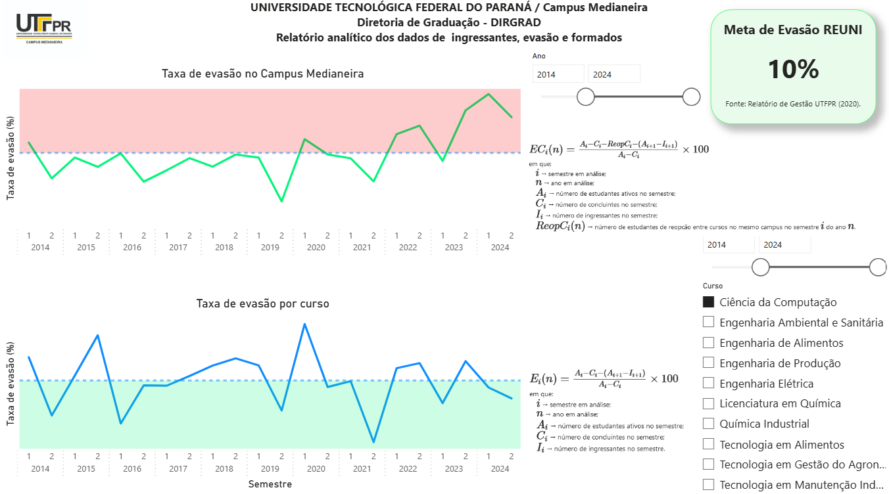
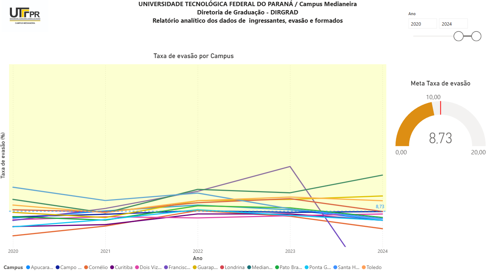
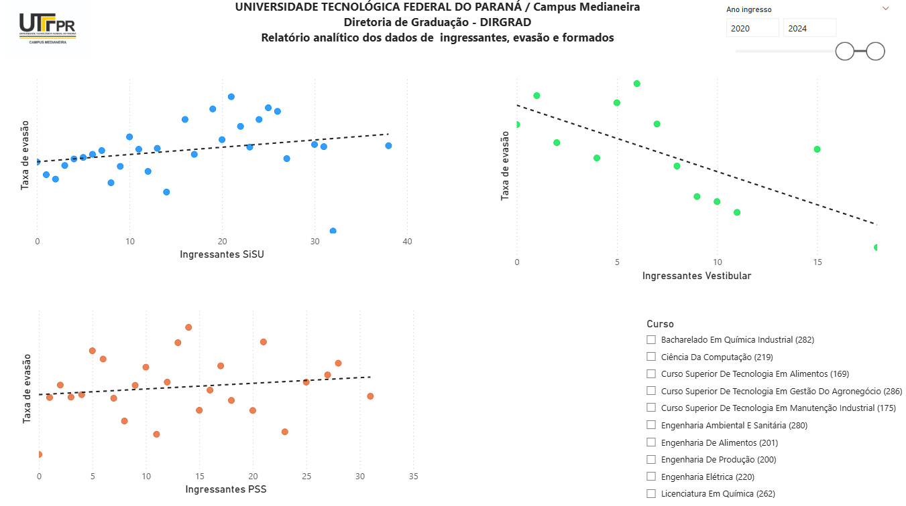

 &nbsp; &nbsp;</a>
 </a>

# Estruturação de cenário relacionado à evasão discente 

Este repositório contém um projeto de Análise de Dados executado com base em um conjunto de dados disponíveis no sistema acadêmico de uma universidade federal. O projeto teve como objetivo estruturar o cenário relacionado à evasão acadêmica.

# Descrição do Projeto 
- O conjunto de dados foi composto pelo histórico de informações acadêmicas, compreendido pelo período de 2015 à 2025.
- Cada linha das tabelas geradas correspondem a um curso, em um determinado ano e semestre.
- O objetivo do projeto foi visualizar o comportamento histórico da evasão discente entre cursos e entre diferentes Campus da universidade, possibilitando a análise de indicadores e a correlação entre variáveis. 
  
# Conjunto de Dados 
- Os dados foram coletados no sistema acadêmico da universidade, após tratamento e limpeza, foram submetidos à análises estatísticas descritivas, definições de correlações causais e temporais com auxílio do PowerBI.

# Conclusões 
A análise histórica de dados da evasão discente permitiu identificar e interpretar tendências a partir de indicadores criados e já existentes, possibilitando a definição de estratégias para mitigar a evasão e promover a permanência. As percepções de maior impacto foram:

- [x] COMPORTAMENTO DA TAXA DE EVASÃO 

Existem diferentes equações para mensurar a taxa de evasão, no entanto, os dois indicadores utilizados neste projeto evidenciaram a tendência de aumento da taxa de evasão a partir do ano de 2019.

- [x] EVASÃO EM DIFERENTES CURSOS

Notou-se que o aumento da evasão não foi uniforme, uma vez que diferentes cursos apresentaram comportamentos distintos: enquanto alguns registraram tendências positivas, outros mantiveram a estabilidade do indicador ou diminuíram. Essa heterogeneidade permitiu uma análise mais profunda das variáveis específicas que influenciam o desempenho e a evasão em cada área de graduação.

- [x] IDENTIFICAÇÃO DE VARIÁVEIS

Os resultados destacam a influência da modalidade de seleção na permanência acadêmica. Verificou-se que, enquanto o ingresso por vestibular reduz as probabilidades de evasão (correlação negativa), o ingresso via SISU caminha no sentido oposto, apresentando taxas de evasão mais elevadas. Tais inferências sugerem a necessidade de estratégias de mitigação à evasão diferenciadas conforme o perfil de entrada do discente. 

# Limitações

- [x] A equação utilizada pela gestão acadêmica para gerar o indicador de evasão ameniza a real situação de desistência acadêmica.

# Próximos Passos

- A análise permitiu a sugestão de uma nova abordagem para a taxa de evasão como indicador, que deverá ser aprimorada.
- ANÁLISE COM DISCENTES REGULARES: Com a definição do panorama geral da evasão na universidade objeto deste projeto, a análise deve ter continuidade a partir dos dados relacionados aos discentes em situação ativa (matriculados).

# Dashboards

  
  
  

